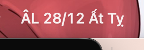
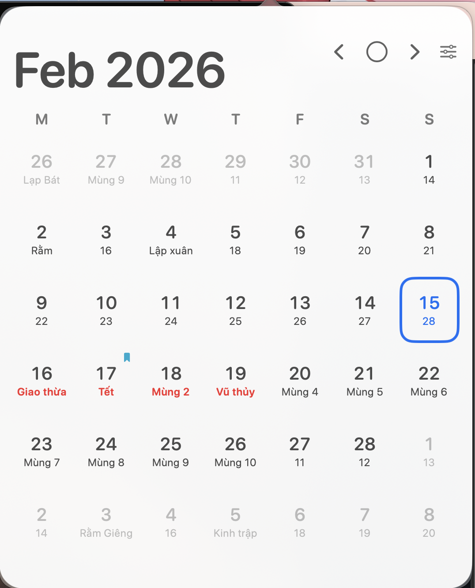

# LunarCalendar

A native macOS menu bar app that displays Vietnamese lunar calendar information (`Lịch âm`) with an interactive monthly popup calendar.

## Preview

### Menu bar label


### Calendar popup


- The menu bar label is compact and readable (`ÂL 28/12 Ất Tỵ`), showing lunar info at a glance.
- The popup is calendar-focused with Vietnamese lunar labels per day.
- Selected-day state is highlighted with a blue outline.
- Key lunar days are marked in red (`Giao thừa`, `Tết`, `Mùng 2`, `Vũ thủy`).
- Settings is directly accessible from the header icon.

## Features

- **Menu bar integration** — native popover with customizable label styles (lunar compact, calendar icon, symbol, custom format).
- **Vietnamese lunar calendar** — lunar day/month, zodiac year, leap month support.
- **Festivals and holidays** — highlights Tết, Mid-Autumn, and other Vietnamese occasions.
- **Solar terms** — displays the 24 solar terms (`Tiết khí`) mapped to Vietnamese names.
- **Calendar and Reminders** — integrates with macOS Calendar and Reminders via EventKit, with an 8-day agenda view.
- **Agenda caching** — Core Data–backed cache for faster agenda loading.
- **Settings** — toggle holidays, solar terms, reminders display; choose first weekday; select calendar sources; pick menu bar style with custom DateFormatter support.
- **Launch at login** — via ServiceManagement (macOS 13+).
- **CI/CD** — GitHub Actions workflow to build, test, package DMG, and publish releases.

## Requirements

- macOS 14.0+
- Swift 6.0
- Xcode 16+

## Local Development

Run tests:

```bash
swift test
```

Build with Xcode:

```bash
xcodebuild -project LunarCalendarApp.xcodeproj \
  -scheme LunarCalendarApp \
  -configuration Debug \
  -derivedDataPath ./.xcodebuild \
  build
```

Before first run, set your Apple Development Team in Xcode (`Target > Signing & Capabilities`) so macOS can persist Calendar/Reminders permissions correctly.

Run the built app:

```bash
open .xcodebuild/Build/Products/Debug/LunarCalendarApp.app
```

Regenerate the Xcode project (requires [XcodeGen](https://github.com/yonaskolb/XcodeGen)):

```bash
xcodegen generate
```

## Project Structure

```
Sources/LunarCalendarApp/
├── LunarCalendarApp.swift          # @main entry point
├── MenuBarController.swift         # Status bar item and popover control
├── AppState.swift                  # @Observable app state and refresh logic
├── Models.swift                    # LunarDayInfo, AgendaItem, UserSettings, etc.
├── DateSupport.swift               # Calendar utilities
├── Views/
│   ├── CalendarPopoverView.swift   # Main popup with header and navigation
│   ├── MonthGridView.swift         # 7×6 day grid with lunar labels
│   ├── AgendaListView.swift        # Events and reminders list
│   ├── AppSettingsView.swift       # Settings window
│   ├── SettingsContentView.swift   # Settings form controls
│   └── SettingsSectionView.swift   # Reusable settings card
├── Services/
│   ├── LunarService.swift          # Lunar date calculations and festivals
│   ├── EventKitService.swift       # Calendar/Reminders API
│   ├── SettingsStore.swift         # UserDefaults JSON persistence
│   └── LaunchAtLoginManager.swift  # SMAppService wrapper
└── Persistence/
    ├── PersistenceController.swift # Core Data stack
    ├── AgendaCacheStore.swift      # Agenda caching logic
    └── CachedAgendaItem.swift      # Core Data entity

Tests/LunarCalendarAppTests/
├── LunarServiceTests.swift
├── AppStateBehaviorTests.swift
├── AppStateSourceSelectionTests.swift
└── AgendaCacheStoreTests.swift
```

## CI/CD

Workflow: `.github/workflows/build-test-dmg.yml`

Triggers on PRs, pushes to `main`, and version tags (`v*`).

1. Runs `swift test`.
2. Builds the app in Release configuration.
3. Packages a `.dmg` artifact via `hdiutil`.
4. On version tags — publishes the DMG to a GitHub Release.
